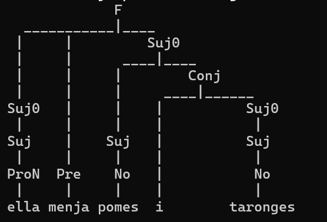

# E2 Generación y Limpieza de una Gramática

Por: Mateo Rodrigo Zapata Crapa (A01708573)

## Descripción

El idioma que he escogido para este proyecto es el catalán. Una leguna hablada principalmente en Cataluña, pero también en otras regiones de España (como la Comunidad Valenciana y las Islas Baleares) (Idioma catalán - Wikipedia, la enciclopedia libre, 2025), además de ser el idioma oficial de Andorra (Andorra - Wikipedia, la enciclopedia libre, 2025). He escogido este idioma porque es uno que sé hablar y entender desde hace tiempo, y me parecía interesante hacer una gramática con él.

El lenguaje es muy cercano al castellano (o español) y, por lo tanto, es bastante similar, pero el vocabulario es diferente y alguna estructura también puede variar de este.

Este programa se trata de un analizador, que te dirá si la frase es correcta en catalán (o no), y en caso afirmativo, desplegará el árbol según la gramática.

## Modelo

Se usará el siguiente vocabulario del catalán para este programa

### Verbos (predicados)

1. tinc = (yo) tengo
2. es = es
3. soc = (yo) soy
4. menjo = (yo) como
5. tens = (tú) tienes
6. ets = (tú) eres
7. menges = (tú) comes
8. te = (él/ella) tiene
9. menja = (él/ella) come

### Pronombres

1. jo = yo
2. tu = tu
3. ell = él
4. ella = ella

### Artículos

1. un = un
2. una = una
3. uns = unos
4. unes = unas
5. el = el
6. la = la
7. els = los
8. les = las

### Nombres (sustantivos)

1. cotxe = coche
2. finestra = ventana
3. pomes = manzanas
4. monedes = monedas
5. estudiant = estudiante
6. llibres = libros
7. taronges = naranjas

### Conjunciones

1. i = y

## Gramática

Para esta gramática, ya se diseño directamente con la idea de que no tuviera ni recursividad izquierda ni ambigüedad. El lenguaje natural (en este caso, el catalán) si tiene ambigüedad, hecho que, según la jerarquía diseñada por Noam Chomsky, sean de nivel 1, o sea, sensibles al contexto.
Para este programa, no se trata de una representación completa del catalán, si no de una versión simplificada, sin ambigüedad, algo más simple, y que lo sitúa en el nivel 2 (más bajo en cuanto a complejidad), siendo libre de contexto.

Este sería el ejemplo de un árbol generado con una de las frases:

La gramática funciona con la F inicial, que representa una frase, pudiendo luego relacionar el sujeto y el predicado de diferentes maneras. Se usa el estado intermedio Suj0 para poder hacer posible continuar las frases mediante conjunciones. Suj representa el sujeto, que puede usar un pronombre, artículo y nombre o tan solo nombre.
Los predicados están ya directamente como diferentes verbos.
Hay varios artículos y nombres ya registrados.

## Implementación

Este programa tiene un conjunto de frases ya guardadas, y su funcionamiento es automático, el usuario solo debe oprimir el número 1 para que se ejecute. 
Las siguientes frases son correctas:

1. "jo menjo" = "yo como"
2. "jo tinc un cotxe" = "yo tengo un coche"
3. "jo menjo pomes" = "yo como manzanas"
4. "jo tinc unes monedes" = "yo tengo unas monedas"
5. "tu ets estudiant" = "tu eres estudiante"
6. "ell te uns llibres" = "él tiene unos libros"
7. "ella menja pomes i taronges" = "ella come manzanas y naranjas"
8. "jo soc estudiant i tinc llibres i tinc un cotxe" = "yo soy estudiante y tengo libros y tengo un coche"

Las siguientes son incorrectas:

1. "jo tinc finestra una" = "yo tengo ventana una" (mal orden del artículo y el nombre)
2. "ell te uns libros" = "él tiene unos libros" (uso de la palabra libros en castellano, no en catalán)
3. "ella cotxe es" = "ella coche es" (mal orden del predicado y el nombre)
4. "ell finestra" = "él ventana" (sin predicado, frase sin sentido)

## Análisis 

El programa no es de una complejidad muy elevada, generalmente manteniéndose con el número de palabras que tiene, o sea, sería O(n) para su complejidad temporal. En cuanto a su complejidad espacial, sigue sin ocupar mucho espacio, además, los datos son los que hay, no se genera nada nuevo aquí, así que esta también sería de O(n). Es un programa ligero y sencillo, pero muy útil para entender como funcionan los análisis de gramáticas a un nivel básico.
El uso de NLTK y Python (ya que es una librería de este lenguaje) no requiere de una curva de aprendizaje muy grande, además de que las complejidades, como ya he mencionado anteriormente, no son muy altas, haciendo que sea una opción ideal para este propósito.

## Referencias

Andorra - Wikipedia, la enciclopedia libre. (7 de junio de 2025). Obtenido de Wikipedia, la enciclopedia libre: https://es.wikipedia.org/wiki/Andorra
Idioma catalán - Wikipedia, la enciclopedia libre. (4 de junio de 2025). Obtenido de Wikipedia, la enciclopedia libre: https://es.wikipedia.org/wiki/Idioma_catal%C3%A1n
